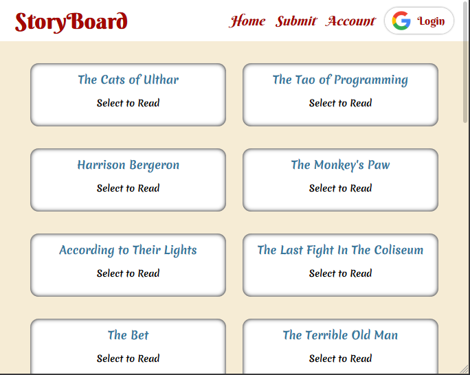
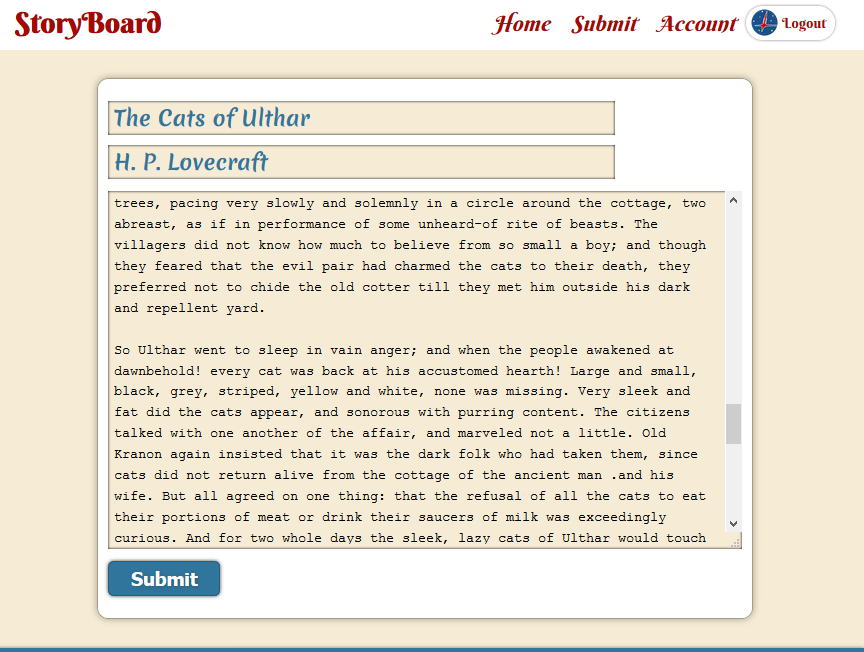
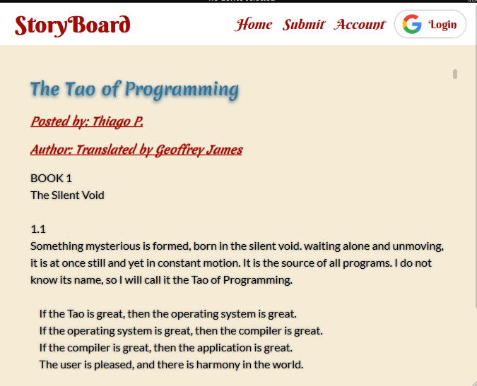
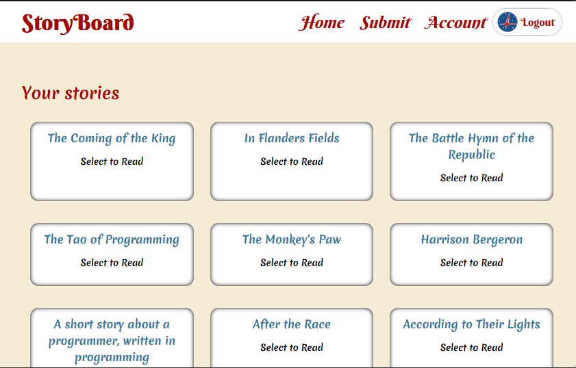

## Story Board
A full stack **MERN** application allowing users to view random user-generated stories and post their own, either anonymously or by logging in with their google account.

[Deployed Website - https://storyboard-thpc.herokuapp.com/](https://storyboard-thpc.herokuapp.com/)
  

|       |       |
|-------|-------|
|  | 
  
|       |       |
|-------|-------|
|  | 

### Authentication
Logins are performed using the Google API and their Auth2 library.

### API
Detailed API information is located at [docs/api.md](docs/api.md)

### Usage
1. Clone this repo from github.
> git clone https://github.com/ninjaboynaru/storyboard

2. Setup a new project on [Googles' Cloud Platform](https://cloud.google.com/) and obtain an OAuth2 client id. Also be sure to add the URLs you'll be hosting/testing the site on, to the **Allowed Origins** part of the Google cloud project.
3. Read [docs/config](docs/config.md) about setting up the necessary config files. Some of them are already setup.
4. Install dependencies
> npm install  

5. Build the front end files
> npm run build || or || npm run watch

6. Run the server
> npm run start || or || npm run start-dev